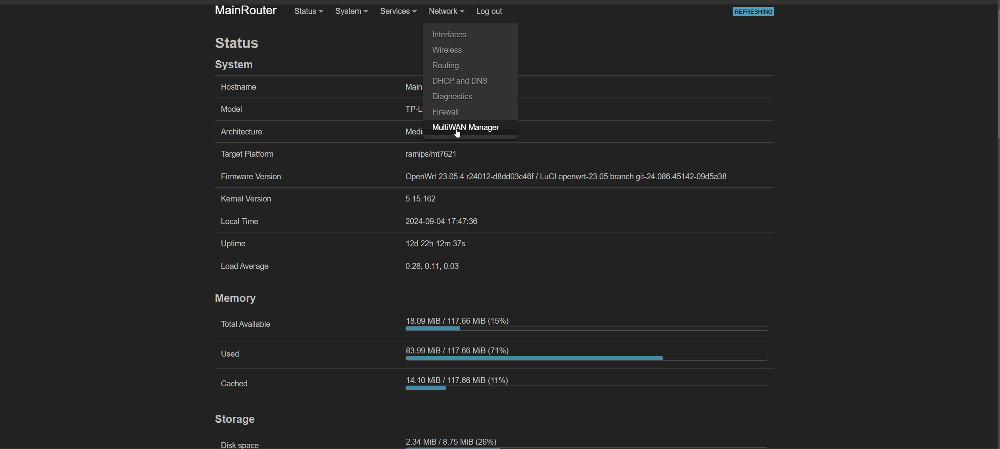

## What is OpenWRT?
OpenWrt is an open-source project for embedded operating systems based on Linux, primarily used on embedded devices to route network traffic.
Check out how to install OpenWRT on your Router and check if your Router is supported. 
#### [Table of Hardware](https://openwrt.org/toh/start)

## mwan3 (Multi WAN load balancing/failover)
mwan3 is a package available in OpenWRT.

